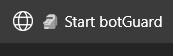

<h1 style="text-align: center;">
  BotGuardExtension
</h1>

<p style="text-align: center;">
  
  
  <a href="https://paulocesar-dev404.github.io/me-apoiando-online/">
    
  </a>
</p>

---

## Descrição

BotGuardExtension é uma biblioteca que facilita a obtenção de atestações do **BotGuard** via WebSockets. Ela permite integrar seu navegador com a API do BotGuard, tornando a comunicação com o servidor mais eficiente e direta.

### Funcionalidades:

- ✅ **PoToken**  
- ✅ **BotGuardResponse**  

---

## Iniciando

Antes de utilizar a extensão, é necessário iniciar o servidor WebSocket em seu ambiente virtual. Para isso, siga as instruções abaixo:
### instalação do módulo

```cmd
pip install https://github.com/PauloCesar-dev404/BotGuardExtension/dist/botguardextension-1.0.0.0-py3-none-any.whl
```


### 1. Inicie o servidor WebSocket

No seu ambiente virtual, execute o seguinte comando para iniciar o servidor WebSocket:

```commandline
BG_Ws
```

Esse comando irá iniciar o servidor em seu ambiente local. Agora, você pode criar seu cliente Python e conectar a extensão!

Ou, se preferir, pode criar um script para o servidor:

### 2. Criando o Cliente Python

```python
# websocket
from BotGuardExtension import BotGuardWs

ws = BotGuardWs()

try:
    ws.start()  # Inicia o servidor WebSocket
except Exception as e:
    print(f"ERROR: {e}")
```

---

## Extensão para o Navegador

Após baixar e descompactar o repositório, siga as instruções abaixo para configurar a extensão no seu navegador.

### 1. Carregar a Extensão no Navegador

#### Para Microsoft Edge:

1. Acesse a página de extensões: `edge://extensions/`.
2. Ative a opção "Modo de desenvolvedor" no canto inferior esquerdo.
3. Clique em "Carregar sem compactação" e selecione a pasta `BotGuardBrowser` que foi extraída do repositório.

#### Para Google Chrome:

1. Acesse a página de extensões: `chrome://extensions/`.
2. Ative a opção "Modo de desenvolvedor" no canto superior direito.
3. Clique em "Carregar sem compactação" e selecione a pasta `BotGuardBrowser`.

---

### 2. Iniciando o Cliente no Navegador

Após carregar a extensão, vá até o YouTube ou qualquer página que você deseja testar. Clique no ícone da extensão, e ela criará um favorito que será o iniciador do seu cliente **Browser**. Este favorito permitirá que você se conecte à API local do servidor WebSocket no seu ambiente.



### 3. Como Usar

Agora, toda vez que você desejar iniciar o cliente, basta clicar no favorito criado. Isso torna o processo simples e rápido!

---

## Considerações Finais

BotGuardExtension oferece uma maneira prática e eficiente de se comunicar com o servidor WebSocket local e integrar com a extensão do navegador. Basta seguir os passos simples para configurar e começar a usar.

